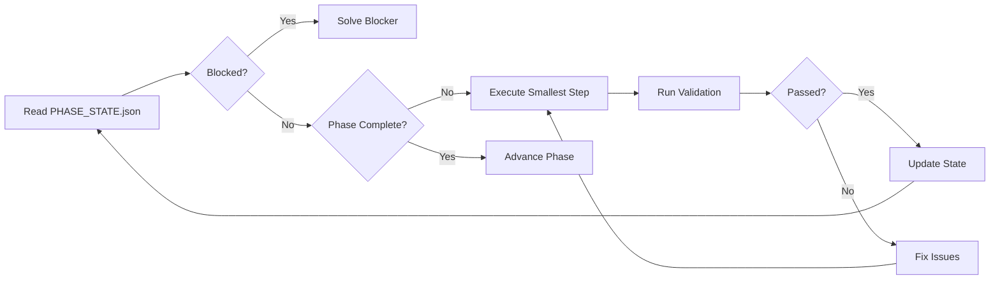

# AGENT_MASTER.md - Complete System Law for AI Coding Agents

> **CRITICAL**: This is the single source of truth for AI coding agents.
> **Last Updated**: 2026-01-31
> **Read First**: Agents must read this file completely before writing any code.

---

## Quick Reference Card

**File Purpose**: Single source of truth for AI coding agents - architecture, rules, and patterns.

**When to use this file**:
- Starting any new feature (check locked tech stack first)
- Unsure which pattern to follow (code patterns library)
- Something broke (error recovery playbook)

**Critical sections**: §2 (Non-Negotiable Rules), §6 (Code Patterns), §8 (Anti-Patterns)

**Common tasks**:
- Check if a library is allowed → Section 3 (Tech Stack Locked)
- Find correct code pattern → Section 6 (Code Patterns Library)
- Avoid common mistakes → Section 8 (Anti-Patterns)
- Understand current project state → Section 1 (System Overview)
- Debug failing changes → Section 9 (Error Recovery Playbook)

**Quick validation**:
```bash
flutter analyze && cd admin-panel && npm run build
```

---

## Table of Contents

1. [System Overview](#1-system-overview)
2. [Non-Negotiable Rules](#2-non-negotiable-rules)
3. [Tech Stack Locked Decisions](#3-tech-stack-locked-decisions)
4. [File Organization](#4-file-organization)
5. [Phase Execution Protocol](#5-phase-execution-protocol)
6. [Code Patterns Library](#6-code-patterns-library)
7. [Validation Checkpoints](#7-validation-checkpoints)
8. [Anti-Patterns (DO NOT DO)](#8-anti-patterns-do-not-do)
9. [Error Recovery Playbook](#9-error-recovery-playbook)
10. [Decision Ledger](#10-decision-ledger)

---

## 1. System Overview

### What This Project Is

**AppShell** - A comprehensive documentation and implementation framework for AI coding agents building educational platforms with:
- **Student App**: Flutter tablet app for practicing questions offline
- **Admin Panel**: React web app for managing curriculum
- **Backend**: Supabase (PostgreSQL + Auth + Realtime)

### What's Already Built (Current State)

**Completed Phases**:
- ✅ Phase -1: Environment validated (Flutter, Node, Supabase CLI)
- ✅ Phase 0: Projects bootstrapped (Flutter & React initialized)
- ✅ Phase 1: Database schema deployed (migrations + RLS + seed data)
- ✅ Phase 2: Student app core loop (offline-first with Drift sync)
- ✅ Phase 3: Admin panel MVP (CRUD + publish workflow)
- ✅ Phase 4: Hardening (observability + CI/CD)

**Current Phase**: All phases completed - maintenance mode

### Key Architecture Decisions

| Component | Decision | Why |
|-----------|----------|-----|
| Student App | Flutter + Riverpod + Drift | Offline-first requirement |
| Admin Panel | React + Vite + React Query | Fast iteration, familiar |
| Database | PostgreSQL (Supabase) | RLS security, realtime |
| Auth | Supabase Auth (Email/OAuth) | Built-in, secure |
| Student Data | Device-bound (Email/OAuth login required) | No anonymous auth, cloud-backed |
| Sync Strategy | Delta sync + Outbox pattern | Offline reliability |

---

## 2. Non-Negotiable Rules

### For All Agents

1. **NO FREELANCING**: Do not introduce libraries, patterns, or architecture not explicitly listed in this document
2. **WORK IN PHASES**: Complete a phase fully, run validations, stop at checkpoint
3. **SMALL CHANGES**: Each phase = clean, reviewable change set with summary
4. **SECURITY FIRST**: Never rely on UI-only restrictions. Always enforce RLS
5. **DETERMINISTIC**: Prefer explicitness over cleverness
6. **TRACK STATE**: Update `PHASE_STATE.json` after every validation
7. **WIRE EVERYTHING**: When creating hooks/functions, wire them to UI immediately
8. **READ SKILLS**: Before implementing features, read relevant skill documentation

### Critical Pre-Implementation Checks

**BEFORE creating ANY Admin Panel component**:
- [ ] Verify `npx shadcn-ui@latest init` was run
- [ ] Verify `src/index.css` contains ALL CSS variables (`:root` block)
- [ ] Verify `tailwind.config.js` has `colors` mapping and `darkMode: ["class"]`
- [ ] Verify `tailwindcss-animate` plugin is installed

**BEFORE running database migrations**:
- [ ] Read `AppShell/docs/SCHEMA.md` section on RLS policies
- [ ] Understand `is_admin()` vs `role = 'admin'` distinction
- [ ] Plan rollback strategy if migration fails

**BEFORE implementing Flutter database**:
- [ ] Use platform detection (`kIsWeb`) - NEVER hardcode platform
- [ ] Web platform (browser testing only) → `driftDatabase()`
- [ ] Native platform (production Mac/Windows) → `NativeDatabase` with file path
- [ ] Do NOT apply web-specific fixes unless explicitly requested

---

## 3. Tech Stack Locked Decisions

### Student App (Flutter)

```yaml
# pubspec.yaml - Locked Dependencies
dependencies:
  flutter_riverpod: ^2.5.0      # State management ONLY
  drift: ^2.15.0                 # Local database
  supabase_flutter: ^2.0.0       # Backend client
  connectivity_plus: ^6.0.0      # Network detection
  sentry_flutter: ^8.0.0         # Error tracking
  uuid: ^4.3.0                   # UUID generation
  google_sign_in: ^6.2.0         # OAuth login
```

**FORBIDDEN**:
- ❌ Provider (use Riverpod instead)
- ❌ BLoC (use Riverpod instead)
- ❌ GetX (use Riverpod instead)
- ❌ sqflite (use Drift instead)
- ❌ Anonymous auth (require login: Email/OAuth)

### Admin Panel (React)

```json
{
  "dependencies": {
    "react": "18.2.0",
    "@tanstack/react-query": "^5.17.0",  // Server state ONLY
    "@supabase/supabase-js": "^2.39.0",  // Backend client
    "react-hook-form": "^7.49.0",        // Forms
    "@hookform/resolvers": "^3.3.0",     // Zod integration
    "zod": "^3.22.0",                    // Validation
    "tailwindcss": "^3.4.0",             // Styling
    "@sentry/react": "^7.92.0"           // Error tracking
  }
}
```

**FORBIDDEN**:
- ❌ Redux (use React Query for server, Context for UI state)
- ❌ MobX (use React Query)
- ❌ Formik (use react-hook-form)
- ❌ Yup (use Zod)

### Backend (Supabase)

- **Database**: PostgreSQL 15+
- **Auth**: Supabase Auth (Email/Password + Google OAuth) - NO anonymous auth
- **Realtime**: Supabase Realtime (for curriculum updates)
- **Storage**: Not used in MVP

---

## 4. File Organization

### Project Root Structure

```
AppShellDocs/
├── AGENT_MASTER.md           ← You are here (THE LAW)
├── AGENTS.md                 ← Execution contract summary
├── PHASE_STATE.json          ← Progress tracker
│
├── AppShell/
│   ├── docs/
│   │   ├── AGENTS.md         ← Canonical execution contract
│   │   ├── SCHEMA.md         ← Database reference
│   │   ├── ADMIN_PANEL_COMPLETE.md  ← Admin panel guide
│   │   └── specs/            ← Detailed specifications
│   └── docs/                 ← Documentation structure
│
├── student-app/              ← Flutter project
│   ├── lib/
│   │   ├── database/         ← Drift setup
│   │   ├── features/         ← Feature modules
│   │   ├── repositories/     ← Data access layer
│   │   └── services/         ← Sync, auth
│   └── pubspec.yaml
│
├── admin-panel/              ← React project
│   ├── src/
│   │   ├── components/       ← UI components
│   │   ├── features/         ← Domain features
│   │   ├── hooks/            ← React Query hooks
│   │   └── lib/              ← Utilities
│   └── package.json
│
├── supabase/
│   ├── migrations/           ← SQL migrations (TRUTH)
│   └── seed.sql              ← Development data
│
├── scripts/                  ← Validation scripts
└── PHASE_STATE.json          ← Progress tracker
```

### Student App Structure (Detailed)

```
lib/
├── database/
│   ├── database.dart         ← Main Drift database class
│   ├── database.g.dart       ← Generated (build_runner)
│   └── tables/
│       ├── domains.dart
│       ├── skills.dart
│       ├── questions.dart
│       ├── attempts.dart
│       └── outbox.dart
│
├── features/
│   ├── practice/
│   │   ├── practice_screen.dart
│   │   └── question_runner.dart
│   └── progress/
│       └── progress_screen.dart
│
├── repositories/
│   ├── domain_repository.dart
│   ├── skill_repository.dart
│   ├── question_repository.dart
│   └── attempt_repository.dart
│
└── services/
    ├── sync_service.dart     ← Handles push/pull
    └── auth_service.dart     ← Wraps Supabase Auth
```

### Admin Panel Structure (Detailed)

```
src/
├── components/
│   ├── ui/                   ← shadcn/ui components
│   │   ├── button.tsx
│   │   ├── dialog.tsx
│   │   └── ...
│   └── layout/
│       └── AppLayout.tsx
│
├── features/
│   ├── domains/
│   │   ├── DomainList.tsx
│   │   └── DomainForm.tsx
│   ├── skills/
│   │   ├── SkillList.tsx
│   │   └── SkillForm.tsx
│   └── questions/
│       ├── QuestionList.tsx
│       └── QuestionForm.tsx
│
├── hooks/
│   ├── use-domains.ts        ← React Query hooks
│   ├── use-skills.ts
│   └── use-questions.ts
│
└── lib/
    ├── supabase.ts           ← Supabase client
    ├── schemas.ts            ← Zod schemas
    └── types.ts              ← TypeScript types
```

---

## 5. Phase Execution Protocol

### Phase State Machine



### Validation Script Usage

```bash
# After each phase, run validation
./scripts/validate-phase-0.ps1   # Bootstrap
./scripts/validate-phase-1.ps1   # Database
./scripts/validate-phase-2.ps1   # Student App
./scripts/validate-phase-3.ps1   # Admin Panel
./scripts/validate-phase-4.ps1   # Hardening
```

### Phase Checkpoints

**Phase 0 Checkpoint** (Project Bootstrap):
- [ ] `flutter create student-app` succeeded
- [ ] `npm create vite@latest admin-panel` succeeded
- [ ] `flutter analyze` passes with zero warnings
- [ ] `npm run build` succeeds
- [ ] Both `.env.example` files created

**Phase 1 Checkpoint** (Database):
- [ ] All migrations run without error
- [ ] `is_admin()` function exists and works
- [ ] RLS blocks anonymous INSERT into domains
- [ ] Seed data loaded successfully
- [ ] `supabase db reset --seed` works

**Phase 2 Checkpoint** (Student App):
- [ ] Drift database initializes (with platform detection)
- [ ] All repositories implement CRUD
- [ ] Sync service pushes/pulls correctly
- [ ] Offline indicator shows when disconnected
- [ ] Integration test: offline workflow passes

**Phase 3 Checkpoint** (Admin Panel):
- [ ] Admin can login (must be promoted to admin/super_admin role manually first)
- [ ] Domain CRUD works end-to-end
- [ ] Skill CRUD works end-to-end
- [ ] Question CRUD works (all 5 types)
- [ ] Status changes cascade correctly (Draft ↔ Live)
- [ ] `npm run build` succeeds

**Phase 4 Checkpoint** (Hardening):
- [ ] Sentry initialized (Flutter & React)
- [ ] Error boundaries in React
- [ ] Retry logic in sync service
- [ ] CI/CD pipeline runs (GitHub Actions)
- [ ] Production builds succeed

---

## 6. Code Patterns Library

### 6.1 Flutter Patterns

#### Riverpod Provider Pattern

```dart
// Repository provider (singleton)
final domainRepositoryProvider = Provider<DomainRepository>((ref) {
  final database = ref.watch(databaseProvider);
  return DomainRepository(database);
});

// State provider for list
final domainsProvider = FutureProvider<List<Domain>>((ref) async {
  final repo = ref.watch(domainRepositoryProvider);
  return repo.getAllDomains();
});

// Usage in widget
class DomainListScreen extends ConsumerWidget {
  @override
  Widget build(BuildContext context, WidgetRef ref) {
    final domainsAsync = ref.watch(domainsProvider);

    return domainsAsync.when(
      data: (domains) => ListView.builder(...),
      loading: () => CircularProgressIndicator(),
      error: (err, stack) => ErrorWidget(err),
    );
  }
}
```

#### Drift Database Initialization (CRITICAL)

```dart
import 'package:drift/drift.dart';
import 'package:drift/native.dart';
import 'package:drift/web.dart';
import 'package:flutter/foundation.dart';
import 'package:path_provider/path_provider.dart';
import 'package:path/path.dart' as p;
import 'dart:io';

LazyDatabase _openConnection() {
  // CRITICAL: Always check platform - web is for testing only, native is production
  if (kIsWeb) {
    // Web platform: Use WASM-based database (development/testing only)
    // Production apps are native Mac/Windows, so this path is only for browser testing
    return LazyDatabase(() async => driftDatabase());
  } else {
    // Native platform: Use file-based SQLite (production Mac/Windows apps)
    return LazyDatabase(() async {
      final dbFolder = await getApplicationDocumentsDirectory();
      final file = File(p.join(dbFolder.path, 'db.sqlite'));
      return NativeDatabase(file);
    });
  }
}

@DriftDatabase(tables: [Domains, Skills, Questions, Attempts, Outbox])
class AppDatabase extends _$AppDatabase {
  AppDatabase() : super(_openConnection());

  @override
  int get schemaVersion => 1;
}
```

#### Sync Service Pattern (Push)

```dart
class SyncService {
  final AppDatabase db;
  final SupabaseClient supabase;

  Future<void> pushAttempts() async {
    // Get pending outbox items
    final pending = await db.select(db.outbox)
      .where((o) => o.tableName.equals('attempts') & o.syncedAt.isNull())
      .get();

    if (pending.isEmpty) return;

    try {
      // Batch submit via RPC
      final payloads = pending.map((o) => jsonDecode(o.payload)).toList();
      final result = await supabase.rpc('batch_submit_attempts',
        params: {'attempts_json': payloads}
      );

      // Mark as synced
      await db.batch((batch) {
        for (final item in pending) {
          batch.update(db.outbox, OutboxCompanion(
            id: Value(item.id),
            syncedAt: Value(DateTime.now()),
          ));
        }
      });

    } catch (e) {
      // Log error, retry later with exponential backoff
      Sentry.captureException(e);
    }
  }
}
```

#### Sync Service Pattern (Pull)

```dart
Future<void> pullDomains() async {
  // Get last sync timestamp
  final meta = await db.syncMeta.getSingle(db.syncMeta.tableName.equals('domains'));
  final lastSynced = meta?.lastSyncedAt ?? DateTime.fromMillisecondsSinceEpoch(0);

  // Pull delta changes
  final response = await supabase
    .from('domains')
    .select()
    .gt('updated_at', lastSynced.toIso8601String())
    .eq('is_published', true)
    .is_('deleted_at', null);

  // Upsert to local DB
  await db.batch((batch) {
    for (final json in response) {
      batch.insert(db.domains,
        DomainsCompanion.insert(...),
        mode: InsertMode.insertOrReplace,
      );
    }
  });

  // Update sync meta
  await db.syncMeta.insertOne(SyncMetaCompanion.insert(
    tableName: 'domains',
    lastSyncedAt: DateTime.now(),
  ), mode: InsertMode.insertOrReplace);
}
```

### 6.2 React Patterns

#### React Query Hook Pattern

```typescript
// hooks/use-domains.ts
import { useQuery, useMutation, useQueryClient } from '@tanstack/react-query';
import { supabase } from '@/lib/supabase';
import { Domain, DomainInsert } from '@/lib/types';

export function useDomains() {
  return useQuery({
    queryKey: ['domains'],
    queryFn: async () => {
      const { data, error } = await supabase
        .from('domains')
        .select('*')
        .order('sort_order');
      if (error) throw error;
      return data as Domain[];
    },
  });
}

export function useCreateDomain() {
  const queryClient = useQueryClient();

  return useMutation({
    mutationFn: async (domain: DomainInsert) => {
      const { data, error } = await supabase
        .from('domains')
        .insert(domain)
        .select()
        .single();
      if (error) throw error;
      return data;
    },
    onSuccess: () => {
      queryClient.invalidateQueries({ queryKey: ['domains'] });
    },
  });
}

export function useUpdateDomain() {
  const queryClient = useQueryClient();

  return useMutation({
    mutationFn: async ({ id, updates }: { id: string; updates: Partial<Domain> }) => {
      const { data, error } = await supabase
        .from('domains')
        .update(updates)
        .eq('id', id)
        .select()
        .single();
      if (error) throw error;
      return data;
    },
    onSuccess: () => {
      queryClient.invalidateQueries({ queryKey: ['domains'] });
    },
  });
}

export function useDeleteDomain() {
  const queryClient = useQueryClient();

  return useMutation({
    mutationFn: async (id: string) => {
      const { error } = await supabase
        .from('domains')
        .update({ deleted_at: new Date().toISOString() })
        .eq('id', id);
      if (error) throw error;
    },
    onSuccess: () => {
      queryClient.invalidateQueries({ queryKey: ['domains'] });
    },
  });
}
```

#### CRUD Form Pattern (Create/Edit/Delete in ONE form)

```typescript
// features/domains/DomainForm.tsx
import { useForm } from 'react-hook-form';
import { zodResolver } from '@hookform/resolvers/zod';
import { z } from 'zod';
import { useCreateDomain, useUpdateDomain, useDeleteDomain } from '@/hooks/use-domains';

const domainSchema = z.object({
  slug: z.string().regex(/^[a-z0-9_]+$/),
  title: z.string().min(1),
  description: z.string().optional(),
  sort_order: z.number().int(),
  is_published: z.boolean(),
});

type DomainFormData = z.infer<typeof domainSchema>;

interface DomainFormProps {
  domain?: Domain;  // If editing
  onSuccess: () => void;
}

export function DomainForm({ domain, onSuccess }: DomainFormProps) {
  const isEditMode = !!domain;

  const createDomain = useCreateDomain();
  const updateDomain = useUpdateDomain();
  const deleteDomain = useDeleteDomain();

  const form = useForm<DomainFormData>({
    resolver: zodResolver(domainSchema),
    defaultValues: domain || {
      slug: '',
      title: '',
      description: '',
      sort_order: 0,
      is_published: false,
    },
  });

  const onSubmit = async (data: DomainFormData) => {
    try {
      if (isEditMode) {
        await updateDomain.mutateAsync({ id: domain.id, updates: data });
      } else {
        await createDomain.mutateAsync(data);
      }
      onSuccess();
    } catch (error) {
      console.error('Save failed:', error);
    }
  };

  const handleDelete = async () => {
    if (!isEditMode) return;
    if (!confirm('Delete this domain?')) return;

    try {
      await deleteDomain.mutateAsync(domain.id);
      onSuccess();
    } catch (error) {
      console.error('Delete failed:', error);
    }
  };

  const isPending = createDomain.isPending || updateDomain.isPending || deleteDomain.isPending;

  return (
    <form onSubmit={form.handleSubmit(onSubmit)}>
      <input {...form.register('slug')} placeholder="Slug" />
      <input {...form.register('title')} placeholder="Title" />
      <textarea {...form.register('description')} placeholder="Description" />
      <input type="number" {...form.register('sort_order', { valueAsNumber: true })} />

      <input type="checkbox" {...form.register('is_published')} />

      <button type="submit" disabled={isPending}>
        {isEditMode ? 'Update' : 'Create'}
      </button>

      {isEditMode && (
        <button type="button" onClick={handleDelete} disabled={isPending}>
          Delete
        </button>
      )}
    </form>
  );
}
```

#### Status Change with Cascade Pattern

```typescript
// When updating domain status, cascade to children
export function useCascadeDomainStatus() {
  const queryClient = useQueryClient();

  return useMutation({
    mutationFn: async ({ domainId, newStatus }: { domainId: string; newStatus: boolean }) => {
      // Start transaction (or use RPC function)
      const { error } = await supabase.rpc('cascade_domain_status', {
        p_domain_id: domainId,
        p_new_status: newStatus
      });
      if (error) throw error;
    },
    onSuccess: () => {
      queryClient.invalidateQueries({ queryKey: ['domains'] });
      queryClient.invalidateQueries({ queryKey: ['skills'] });
      queryClient.invalidateQueries({ queryKey: ['questions'] });
    },
  });
}
```

---

## 7. Validation Checkpoints

### Database Validation (After Migration)

Run these SQL queries in Supabase SQL Editor:

```sql
-- 1. Verify helper functions exist
SELECT public.is_admin();  -- Should return true if you're admin
SELECT public.is_super_admin();  -- Should return true if you're super_admin

-- 2. Check your role
SELECT role FROM public.profiles WHERE id = auth.uid();

-- 3. List RLS policies (verify they use is_admin() not role = 'admin')
SELECT policyname, cmd, qual, with_check
FROM pg_policies
WHERE tablename IN ('domains', 'skills', 'questions');

-- 4. Test INSERT (should succeed as admin)
INSERT INTO public.domains (slug, title, sort_order, is_published)
VALUES ('test-domain', 'Test Domain', 0, false)
RETURNING id;

-- 5. Test INSERT as anon (should FAIL)
SET LOCAL ROLE anon;
INSERT INTO public.domains (slug, title) VALUES ('bad', 'Bad');  -- Should error
RESET ROLE;
```

### Student App Validation (After Phase 2)

```dart
// Test offline workflow
void main() {
  testWidgets('Offline workflow integration test', (tester) async {
    // 1. Create database
    final db = AppDatabase();

    // 2. Insert local domain
    await db.into(db.domains).insert(DomainsCompanion.insert(
      id: Value('test-id'),
      slug: 'math',
      title: 'Mathematics',
    ));

    // 3. Verify it's there
    final domains = await db.select(db.domains).get();
    expect(domains.length, 1);

    // 4. Create attempt (goes to outbox)
    final attempt = AttemptsCompanion.insert(
      id: Value(Uuid().v4()),
      questionId: 'q1',
      response: Value('{"selected_option_id": "a"}'),
    );
    await db.into(db.attempts).insert(attempt);

    // 5. Verify outbox has entry
    final outbox = await db.select(db.outbox).get();
    expect(outbox.length, 1);
    expect(outbox.first.tableName, 'attempts');
  });
}
```

### Admin Panel Validation (After Phase 3)

```typescript
// Validate form submission
describe('DomainForm', () => {
  it('creates domain successfully', async () => {
    const { getByPlaceholderText, getByText } = render(<DomainForm onSuccess={mockOnSuccess} />);

    fireEvent.change(getByPlaceholderText('Slug'), { target: { value: 'math' } });
    fireEvent.change(getByPlaceholderText('Title'), { target: { value: 'Mathematics' } });

    fireEvent.click(getByText('Create'));

    await waitFor(() => {
      expect(mockOnSuccess).toHaveBeenCalled();
    });
  });
});
```

---

## 8. Anti-Patterns (DO NOT DO)

### ❌ Student Authentication

**WRONG**: Create a login screen for students with Email/Password
```dart
// DON'T DO THIS
await supabase.auth.signInWithPassword(email: email, password: password);
```

**RIGHT**: Use Supabase Anonymous Auth (device-bound, no login UI)
```dart
// DO THIS
await supabase.auth.signInAnonymously();
```

**Why**: Students don't need accounts. Anonymous auth provides auth.uid() for RLS and sync.

### ❌ Direct Status Changes

**WRONG**: Update `is_published` directly without cascade
```sql
UPDATE public.domains SET is_published = true WHERE id = '<uuid>';
```

**RIGHT**: Use cascade logic (trigger or RPC)
```sql
SELECT public.cascade_domain_status('<uuid>', true);
```

**Why**: Children must cascade when parent changes status.

### ❌ Student Attempt Submission

**WRONG**: Use REST POST to `/attempts`
```typescript
await supabase.from('attempts').insert(attempt);
```

**RIGHT**: Use RPC `batch_submit_attempts`
```typescript
await supabase.rpc('batch_submit_attempts', {
  attempts_json: [attempt]
});
```

**Why**: RPC is idempotent and enforces `user_id = auth.uid()`.

### ❌ Hardcoded Platform in Flutter Database

**WRONG**: Hardcode native or web platform
```dart
// DON'T DO THIS
LazyDatabase _openConnection() {
  return LazyDatabase(() async => driftDatabase());  // Always web
}
```

**RIGHT**: Use platform detection
```dart
// DO THIS
LazyDatabase _openConnection() {
  if (kIsWeb) {
    return LazyDatabase(() async => driftDatabase());
  } else {
    return LazyDatabase(() async {
      final dbFolder = await getApplicationDocumentsDirectory();
      final file = File(p.join(dbFolder.path, 'db.sqlite'));
      return NativeDatabase(file);
    });
  }
}
```

**Why**: Production apps are native (Mac/Windows), web is testing only.

### ❌ Mixing State Management

**WRONG**: Mix Riverpod with Provider or BLoC
```dart
// DON'T DO THIS
final provider = Provider<Service>(...);  // Using Provider package
final stateNotifier = StateNotifierProvider<...>(...);  // Using Riverpod
```

**RIGHT**: Use ONLY Riverpod
```dart
// DO THIS
final provider = Provider<Service>(...);
final stateProvider = StateNotifierProvider<...>(...);
// All from flutter_riverpod package
```

### ❌ Exposing Supabase Service Role Key

**WRONG**: Use service role key in client-side code
```typescript
const supabase = createClient(url, SERVICE_ROLE_KEY);  // NEVER DO THIS
```

**RIGHT**: Use anon key
```typescript
const supabase = createClient(url, ANON_KEY);  // Always use anon key
```

**Why**: Service role key bypasses RLS. Only use in server functions.

---

## 9. Error Recovery Playbook

### Error: "RLS Policy Denied" (E003)

**Symptom**: INSERT/UPDATE fails with permission error

**Diagnosis**:
```sql
-- Check your role
SELECT role FROM public.profiles WHERE id = auth.uid();

-- Check if is_admin() works
SELECT public.is_admin();
```

**Solution**:
- If role is `student`, promote to `admin`:
  ```sql
  UPDATE public.profiles SET role = 'admin' WHERE id = auth.uid();
  ```
- If `is_admin()` returns false but role is admin, check RLS policies use `is_admin()` not `role = 'admin'`

**Reference**: See `AppShell/docs/SCHEMA.md` > Section 6 (RLS Policies)

### Error: "Flutter Database Not Found" on Web

**Symptom**: Database errors when running `flutter run -d web-server`

**Diagnosis**: Missing WASM files for Drift

**Solution**:
1. Copy WASM files to `web/` directory:
   ```bash
   cp -r $(flutter pub cache get drift)/drift_wasm/ student-app/web/
   ```
2. Verify platform detection is correct in `database.dart`

**Reference**: See `STUDENT_APP_COMPLETE.md` > Section 3 (Database Setup)

**Important**: This is ONLY needed for browser testing. Production (Mac/Windows) uses native SQLite.

### Error: "Cannot find module 'shadcn/ui'" in React

**Symptom**: Import errors for shadcn components

**Diagnosis**: shadcn not initialized

**Solution**:
```bash
cd admin-panel
npx shadcn-ui@latest init
# Follow prompts, then install components:
npx shadcn-ui@latest add button dialog input
```

**Reference**: See `ADMIN_PANEL_COMPLETE.md` > Section 2 (Setup)

### Error: "Supabase Migration Failed" (B005)

**Symptom**: `supabase db reset` fails

**Diagnosis**: SQL syntax error or dependency issue

**Solution**:
1. Check migration order (enums before tables)
2. Verify `IF NOT EXISTS` clauses
3. Check foreign key references
4. Run migrations one-by-one to find culprit:
   ```bash
   supabase migration up --file 20260127000001_create_enums.sql
   ```

**Reference**: See `AppShell/docs/SCHEMA.md` > Section 8 (Migration Guidelines)

### Error: "Sync Conflict Detected" (S004)

**Symptom**: Duplicate attempts with same UUID

**Diagnosis**: Offline attempt synced multiple times

**Solution**: Use `ON CONFLICT (id) DO UPDATE` in `batch_submit_attempts` RPC

**Reference**: See `API_CONTRACTS.md` > Section 3 (batch_submit_attempts)

---

## 10. Decision Ledger

### Resolved Clarifications

All past decisions with rationale:

| ID | Question | Decision | Rationale | Date |
|----|----------|----------|-----------|------|
| PC-001 | Question type enum values? | Use 5 types: multiple_choice, mcq_multi, text_input, boolean, reorder_steps | Covers 90% of use cases without complexity | 2026-01-26 |
| PC-002 | Mastery calculation formula? | `(correct / total) * 100` after 3+ attempts | Simple, intuitive, rewards consistency | 2026-01-26 |
| PC-003 | Point scoring with streaks? | Base points × streak multiplier (1x, 1.5x, 2x) | Gamification without complexity | 2026-01-26 |
| PC-004 | Admin Panel design system? | shadcn/ui + Tailwind | Accessible, customizable, fast setup | 2026-01-26 |
| PC-005 | CI/CD target? | GitHub Actions only for MVP | Simple, free, sufficient | 2026-01-26 |
| PC-006 | Student authentication? | Supabase Anonymous Auth (device-bound) | Provides auth.uid() for RLS and sync | 2026-01-27 |
| PC-007 | User roles table? | Use `profiles.role` ONLY | Simpler, `is_admin()` checks profiles.role | 2026-01-27 |
| PC-008 | Student attempt submission? | Use `batch_submit_attempts` RPC ONLY | Idempotent, secure, handles offline batches | 2026-01-27 |
| PC-009 | Migration strategy? | Granular (15 files) not monolithic | Better maintainability, clearer diffs | 2026-01-27 |

### Open Questions

None currently. All MVP decisions locked.

---

## Checkpoint Summary Template

After completing a phase, create a summary like this:

```markdown
## Phase X Checkpoint Summary

**What Changed**:
- List of implemented features
- New files created
- Configuration updates

**Files Touched**:
- path/to/file1.dart
- path/to/file2.tsx
- migrations/...

**Commands Run + Results**:
- `flutter analyze` → Zero warnings
- `npm run build` → Success
- `supabase db reset` → All migrations applied

**Validation Results**:
- [ ] Checkpoint 1 passed
- [ ] Checkpoint 2 passed
- [ ] Integration test passed

**Risks/Assumptions**:
- Known limitations
- Assumptions made
- Potential issues

**Next Recommended Step**:
Proceed to Phase X+1: [Brief description]
```

---

**END OF AGENT_MASTER.md**